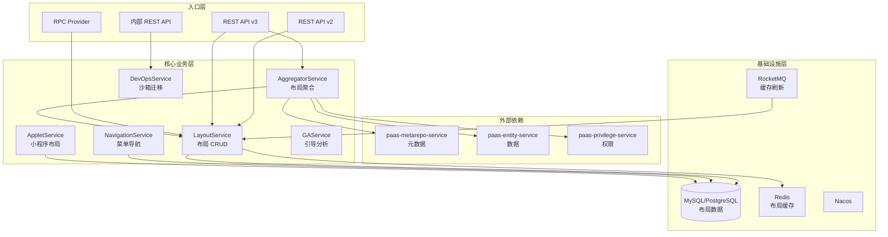
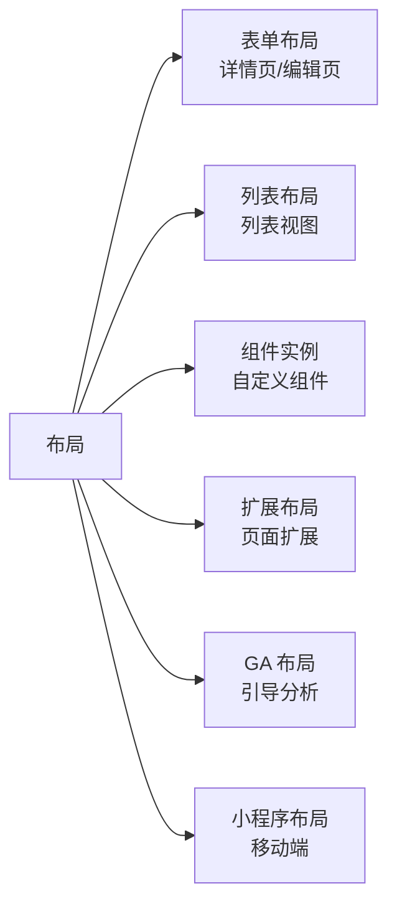
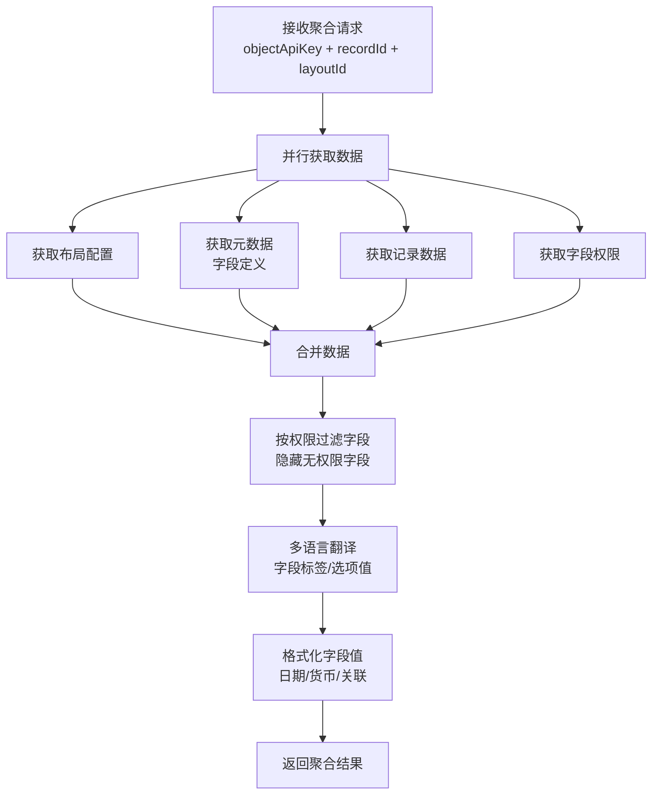
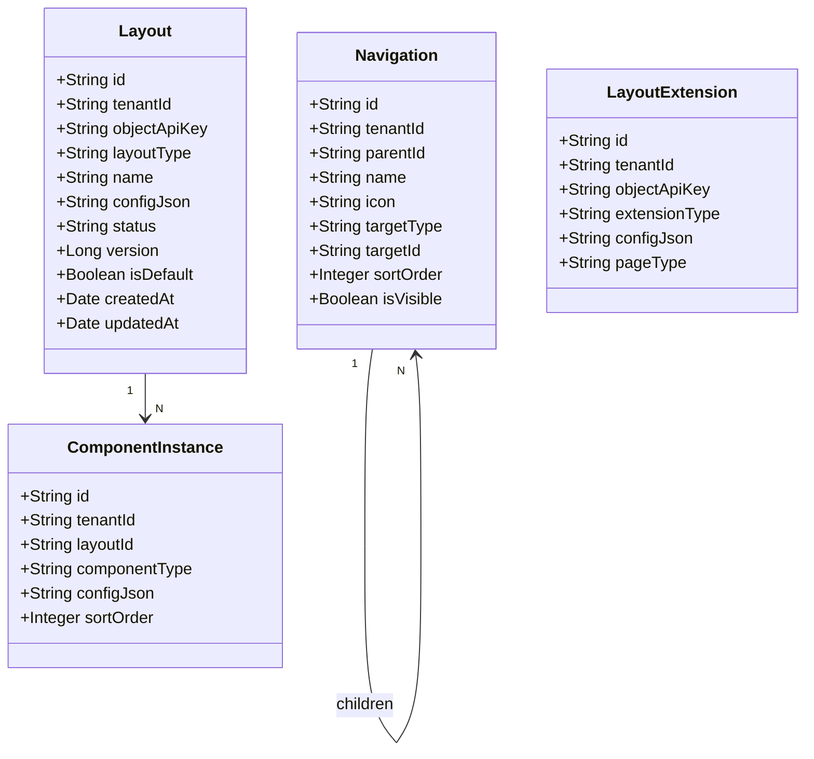
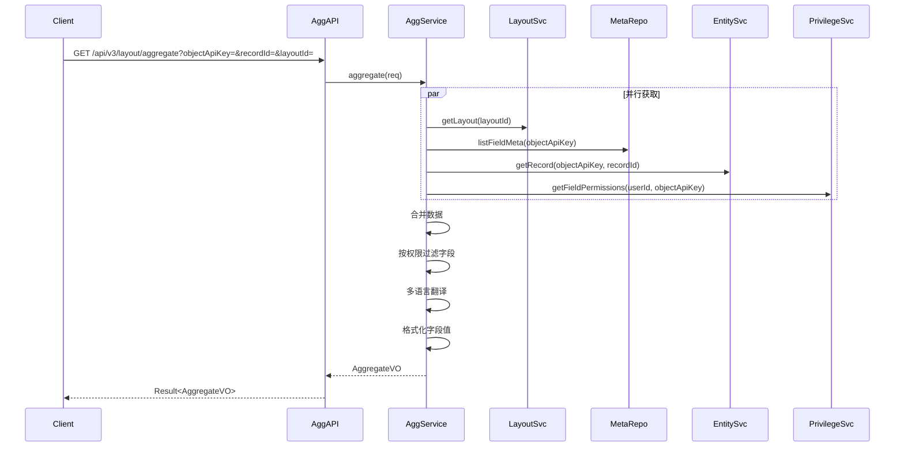
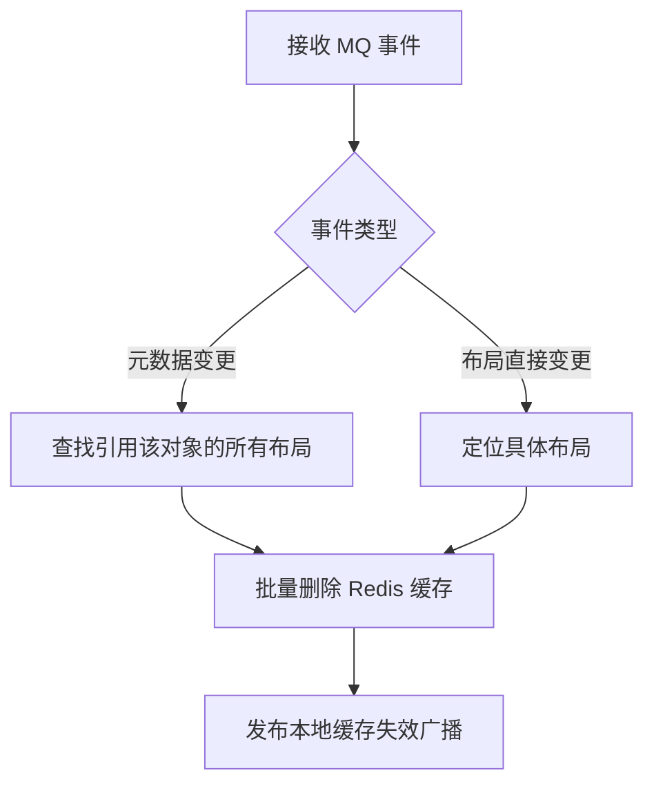

# paas-layout-service 技术设计方案

## 1. 服务概述

布局服务，负责 aPaaS 平台的 UI 布局元数据管理与运行时渲染支持。管理表单布局、列表视图、组件实例、菜单导航等 UI 配置，并提供聚合接口将布局、元数据、数据、权限、多语言整合为前端可直接渲染的数据包。

---

## 2. 系统架构



---

## 3. 布局类型体系



---

## 4. 模块职责

### 4.1 LayoutService（布局 CRUD）

管理所有类型布局的增删改查。

| 方法 | 说明 |
|---|---|
| `createLayout` | 创建布局，校验字段引用合法性 |
| `updateLayout` | 更新布局配置 |
| `deleteLayout` | 删除布局 |
| `getLayout` | 查询布局详情（走缓存） |
| `listLayouts` | 查询对象下的布局列表 |
| `upgradeLayout` | 布局升级（元数据变更后同步布局） |
| `copyLayout` | 复制布局 |

**布局存储结构：**
- 布局配置以 JSON 格式存储（`layout_config` 字段）
- 支持设计态（design）和数据态（data）两种视图
- 布局版本管理，支持回滚

### 4.2 AggregatorService（布局聚合）

核心聚合服务，将多个下游服务的数据整合为前端可直接渲染的数据包。

**聚合内容：**

| 数据来源 | 内容 |
|---|---|
| paas-metarepo-service | 字段定义、字段类型、选项值 |
| paas-entity-service | 记录数据、关联记录数据 |
| paas-privilege-service | 字段权限（可读/可写/隐藏）、按钮权限 |
| 本服务 | 布局配置、组件配置 |
| i18n | 字段标签多语言、选项值多语言 |

**聚合流程：**



**并行调用优化：**
- 布局配置、元数据、记录数据、权限四路并行获取
- 使用 `CompletableFuture.allOf()` 等待所有结果
- 单次聚合 P99 目标 < 200ms

### 4.3 NavigationService（菜单导航）

管理应用的菜单和导航配置。

- 支持多级菜单树结构
- 菜单项关联对象、布局、外部链接
- 按用户权限过滤不可见菜单
- 支持移动端和 PC 端不同菜单配置

### 4.4 GAService（引导分析布局）

管理 Google Analytics 风格的引导分析布局配置。

- 支持漏斗分析、路径分析等布局
- 布局配置与数据分析维度绑定
- 支持布局模板复用

### 4.5 DevOpsService（沙箱迁移）

支持布局配置从沙箱环境迁移到生产环境。

- 生成布局变更 diff
- 按依赖顺序迁移（先迁移被引用的布局）
- 迁移后触发缓存刷新

---

## 5. 数据模型



**configJson 示例（表单布局）：**
```json
{
  "sections": [
    {
      "label": "基本信息",
      "columns": 2,
      "fields": [
        { "fieldApiKey": "Name__c", "required": true, "readonly": false },
        { "fieldApiKey": "Status__c", "required": false }
      ]
    }
  ],
  "buttons": ["save", "cancel", "delete"]
}
```

---

## 6. 核心流程

### 6.1 布局聚合查询（详情页）



### 6.2 布局缓存刷新（MQ 驱动）



**监听的 MQ Topic：**
- `paas.metadata.field.changed` → 刷新引用该字段的布局缓存
- `paas.metadata.object.changed` → 刷新该对象所有布局缓存
- `paas.layout.changed`（自身发布）→ 刷新具体布局缓存

---

## 7. 接口设计

### 7.1 REST 接口

| 方法 | 路径 | 说明 |
|---|---|---|
| POST | `/api/v2/layouts` | 创建布局 |
| PUT | `/api/v2/layouts/{id}` | 更新布局 |
| DELETE | `/api/v2/layouts/{id}` | 删除布局 |
| GET | `/api/v2/layouts/{id}` | 查询布局详情 |
| GET | `/api/v2/layouts` | 查询布局列表 |
| GET | `/api/v3/layout/aggregate` | 布局聚合查询（详情页） |
| GET | `/api/v3/layout/list-aggregate` | 布局聚合查询（列表页） |
| GET | `/api/v2/navigation` | 查询菜单导航 |
| POST | `/api/v2/layouts/{id}/upgrade` | 布局升级 |
| POST | `/internal/devops/migrate` | 沙箱迁移 |

### 7.2 RPC 接口（core module）

```java
@FeignClient(name = "paas-layout-service")
public interface LayoutApi {
    // 查询布局配置
    Result<LayoutDTO> getLayout(String tenantId, String layoutId);

    // 查询对象默认布局
    Result<LayoutDTO> getDefaultLayout(String tenantId, String objectApiKey, String layoutType);

    // 布局聚合（供其他服务调用）
    Result<AggregateDTO> aggregate(AggregateRequest request);
}
```

---

## 8. 缓存策略

| 缓存 Key | 内容 | TTL | 失效时机 |
|---|---|---|---|
| `layout:{tenantId}:{layoutId}` | 布局配置 | 30min | 布局变更/元数据变更 |
| `layout:default:{tenantId}:{objectApiKey}:{type}` | 默认布局 | 30min | 布局变更 |
| `nav:{tenantId}:{userId}` | 用户菜单 | 10min | 菜单变更/权限变更 |

---

## 9. 异常处理

| 异常场景 | 处理策略 |
|---|---|
| 布局引用不存在的字段 | 返回 `LAYOUT_FIELD_NOT_FOUND`，列出缺失字段 |
| 聚合下游超时 | 部分降级：返回已获取的数据，缺失部分用空值填充 |
| 元数据变更导致布局不兼容 | 标记布局为 `NEED_UPGRADE` 状态，提示用户升级 |
| 沙箱迁移冲突 | 返回冲突详情，支持强制覆盖或跳过 |


---

## 10. 数据存储说明

layout-service **不直接维护独立的业务数据库表**。布局配置（表单布局、列表视图、菜单导航等）存储在 `paas-metarepo-service` 的 `xsy_metarepo` schema 中，对应 `p_custom_layout`、`p_meta_neoui_*` 等表，通过 metarepo 的 RPC 接口读写。

<!-- DDL 章节已移除，layout-service 无独立数据库表 -->
